# Fractal_Android
### 分形
一个在安卓设备上欣赏有趣分形图的小软件
***
老早之前看到b站的各种分形视频时，就萌生了自己来整一整这个东西的想法  
由于[之前](https://github.com/Small-Totem/Fractal) 用c实现了渲染分形图，就想着能不能在手机上渲染呢  
一番折腾后，最终用jni实现了对c代码的调用，便有了这个项目  
***
确定的方程、确定的参数，产生了无法预测的结果  
真是太有意思了
# 例子 #
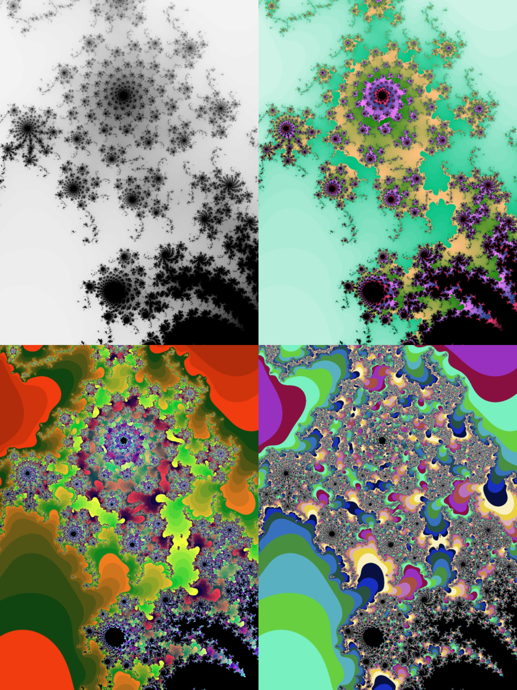   
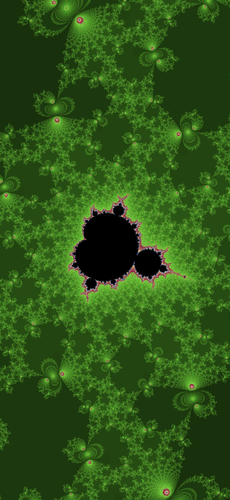 | 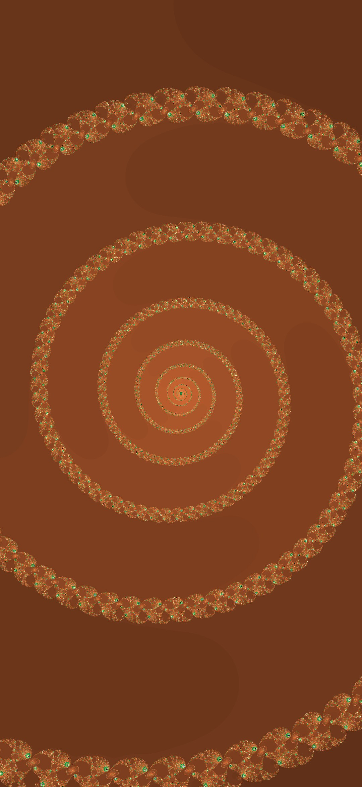
--- | ---  

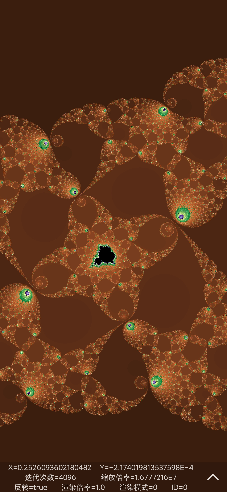 | 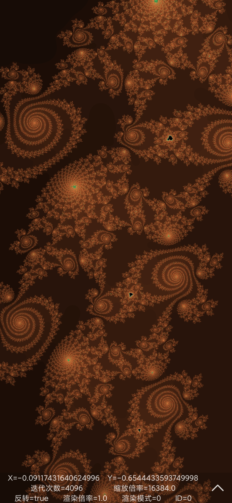 | 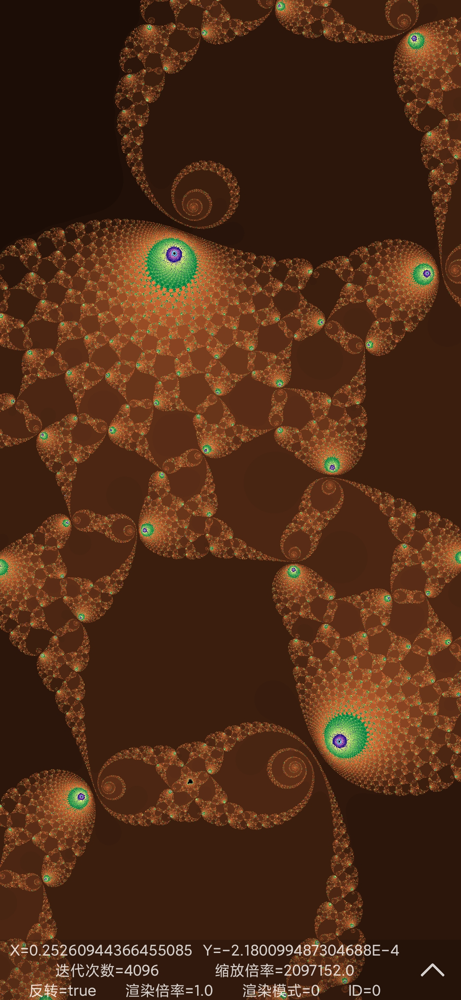
--- | --- | ---  

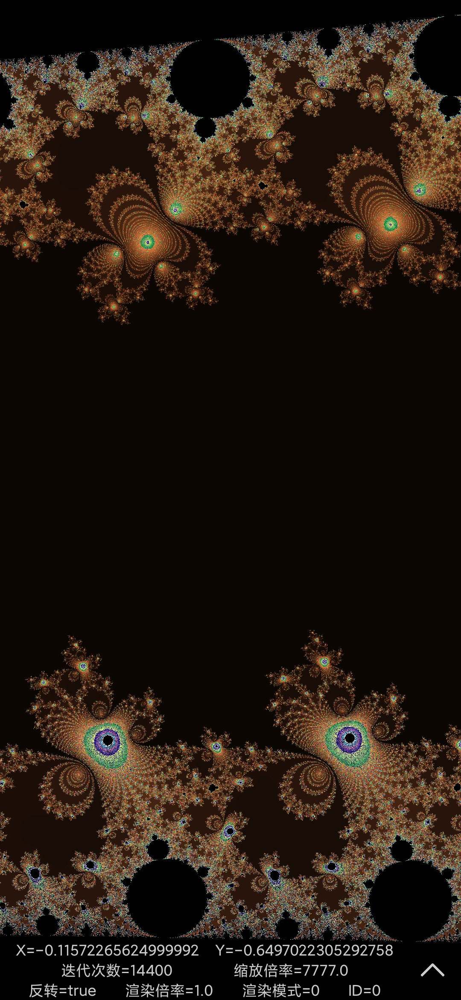 | 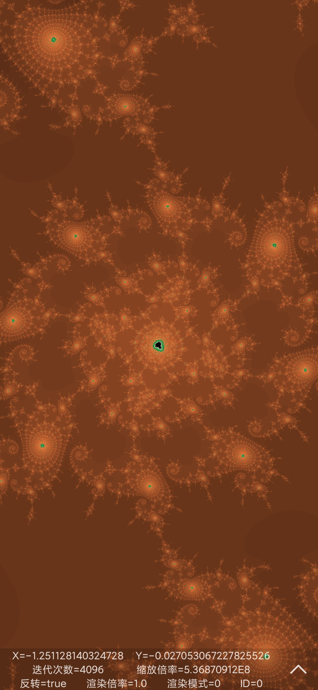 | 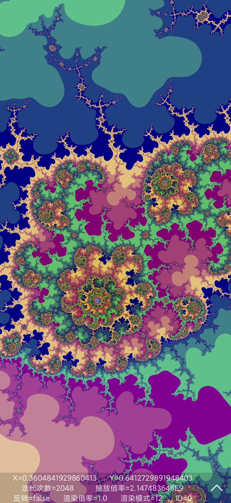
--- | --- | ---  

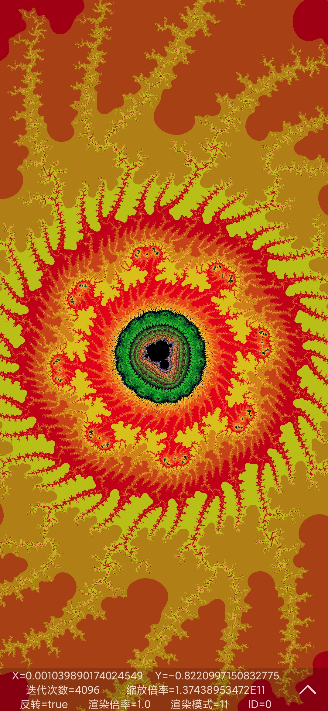 | 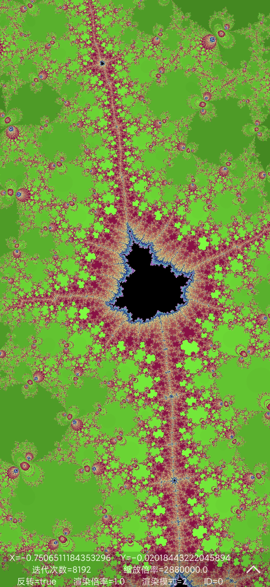 | 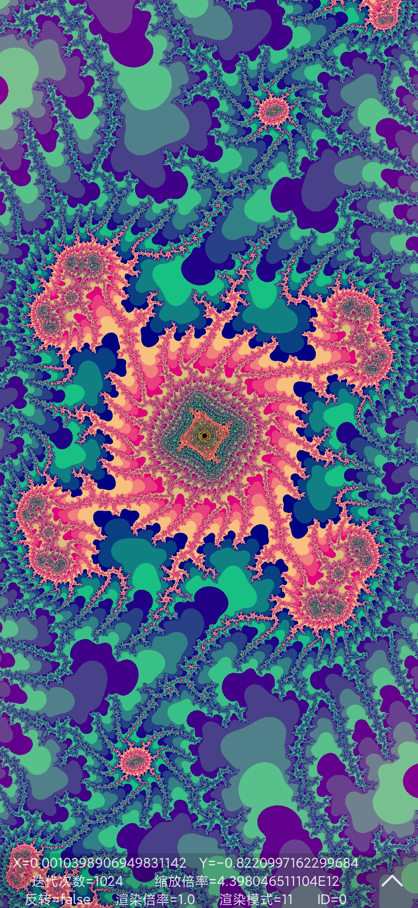
--- | --- | ---  

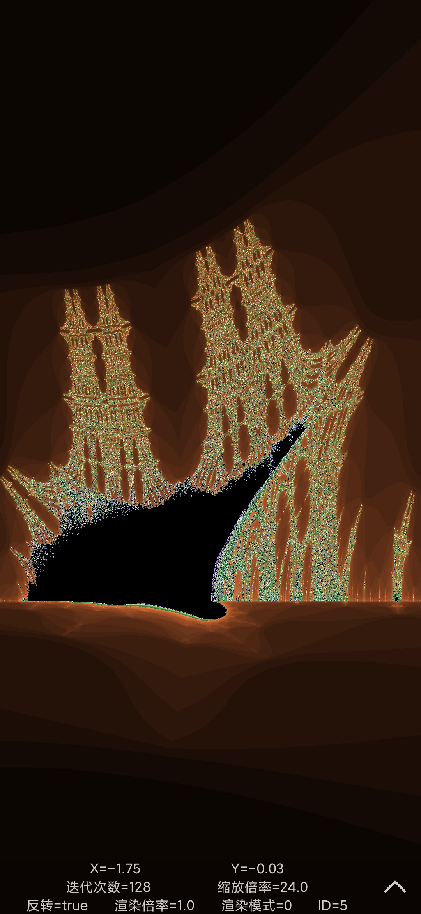 | 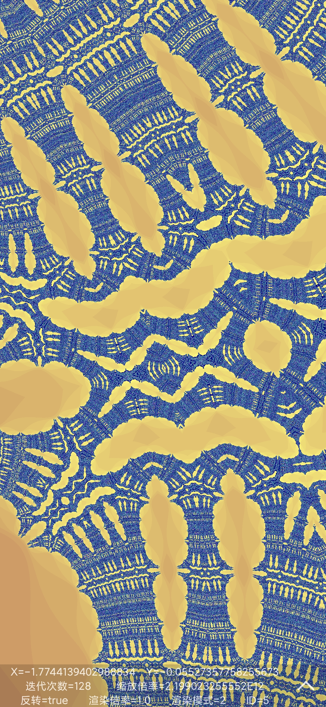 | 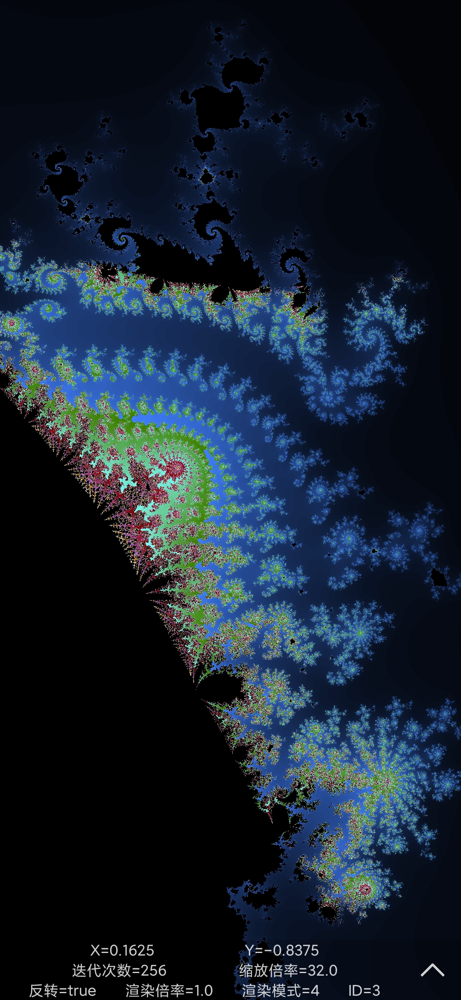
--- | --- | ---  
